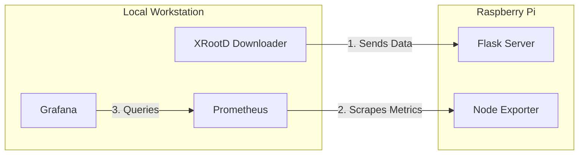

# monitor_xrootd

This repository contains a distributed monitoring system designed to track data transfers via the XRootD protocol. The project utilizes a hybrid architecture involving a local workstation and a Raspberry Pi, orchestrated via Docker and monitored using the Prometheus/Grafana stack.

## 🎯 Purpose
This repository implements a scalable telemetry pipeline for monitoring **XRootD data transfers** across heterogeneous storage nodes. It was specifically designed to demonstrate the technical competencies required for the **CERN Computing Engineer Graduate** position (Ref: IT-TC-LCG-2025-241-GRAE).

### Core Technologies:
- **Data Protocol:** XRootD

- **Containerization:** Docker & Docker Compose

- **Monitoring:** Prometheus & Grafana

- **Backend:** Python (Flask)

- **Node Metrics:**  Node Exporter

## 🏗 Infrastructure Architecture

The system is split into two main logical segments:

1. Local Workstation (Control & Visualization)
- **XRootD Downloader:** A Python-based service running in a Docker container. It handles the retrieval of XRootD files and pushes them to the Raspberry Pi.

- **Monitoring Stack:** A docker-compose deployment consisting of:

  - **Prometheus:** Scrapes metrics from the Raspberry Pi endpoints.

  - **Grafana:** Visualizes the hardware and application metrics.

2. Raspberry Pi (Edge Ingestion Node)
- **Flask Server:** A Python Flask application (Dockerized) that acts as the entry point for data.

- **Node Exporter:** A standard Prometheus exporter running via Docker Compose to monitor the Pi's CPU, RAM, and disk I/O.

## 🛠 Step-by-Step Implementation
### Phase 1: Data Acquisition (The Producer)
The local PC runs a dedicated Python script.

- **Environment:** Defined in a Dockerfile using a slim Python base.

- **Dependencies:** requirements.txt includes the necessary XRootD bindings and requests libraries.

- **Action:** The script connects to an XRootD redirector, downloads the target file, and forwards it to the Flask server on the Raspberry Pi.

### Phase 2: Edge Setup (The Receiver)
On the Raspberry Pi, two services are deployed:

- **Flask API:** Receives the files.

- **Telemetry:** A docker-compose.yml launches Node Exporter, allowing us to see how the Pi handles the overhead of data ingestion.

### Phase 3: Observability (The Monitor)
Back on the local PC, the Prometheus/Grafana stack is initialized:

- **Prometheus Configuration:** The prometheus.yml is configured to target the Raspberry Pi's IP on ports 9100 (Node Exporter) and 5000 (Flask).

- **Grafana Dashboard:** Implemented a customized dashboard (based on standard Node Exporter templates) to correlate file transfer spikes with hardware resource usage on the Pi, specifically focusing on network throughput and CPU load during XRootD ingestion.

 
 This image show the spikes of network usage and CPU when the script's container is run.
## 🚦 How to Run
### Prerequisites
- Docker and Docker Compose installed on both machines.

- Network connectivity between the PC and the Raspberry Pi.

### Deployment
1. Clone the repo:

```bash
git clone https://github.com/diego-alonmoratiel/monitor_xrootd.git
```
2. Copy the *PC* folder to your working directory in your machine and the *raspberry-PI* folder to your edge unit.
3. Start the Node Exporter service in the PI:

```bash
cd raspberry-PI
docker-compose up -d
```
4. Launch the flask server
```bash
docker build -t flask-server .
docker run -d -p 5000:5000 --name flask-server --restart unless-stopped flask-server
```
5. Edit the *PC/script-retrieve-xrd/script.py* and *PC/volumes/prometheus-configprometheus.yml* files to change the value and introduce the IP address of your edge system.
6. Start the Monitoring Stack & Downloader in you Personal Computer:

```bash
cd PC
docker-compose up -d
```
7. Launch the XRootD downloader script

```bash
docker build -t script-retrieve .
docker run --rm -d --name script script-retrieve
```
The launch of this container can be automatized with CRON utility.
## 🔬 Alignment with CERN WLCG Requirements
This project serves as a practical validation of the following skills requested in the IT-TC-LCG-2025-241-GRAE offer:

* **XRootD Monitoring:** Direct experience with the protocol used for global LHC data movement.
* **Scalable Monitoring Pipelines:** Hands-on integration of Prometheus and Grafana for infrastructure health.
* **Distributed Systems:** Managing communication and telemetry between different geographic/hardware "sites" (PC and Pi).
* **Modern DevOps:** Utilizing Git-based workflows and containerized environments (Docker).
* **Metric Validation:** Comparing application-level data (Flask) with system-level statistics (Node Exporter) to ensure data quality.
